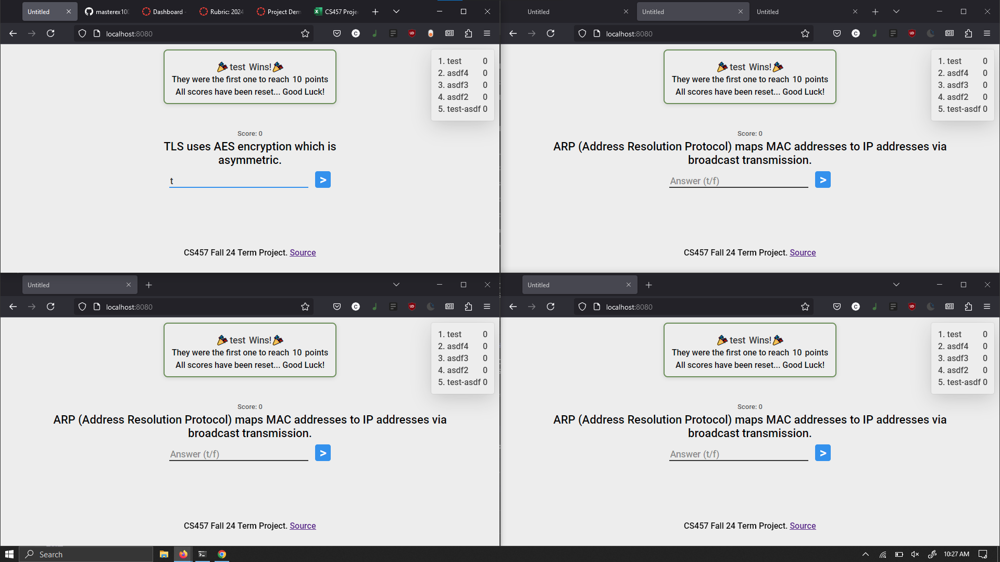
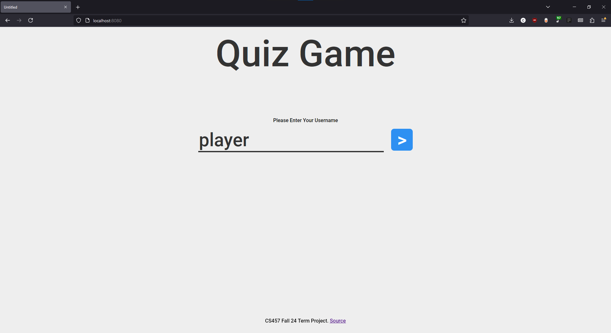
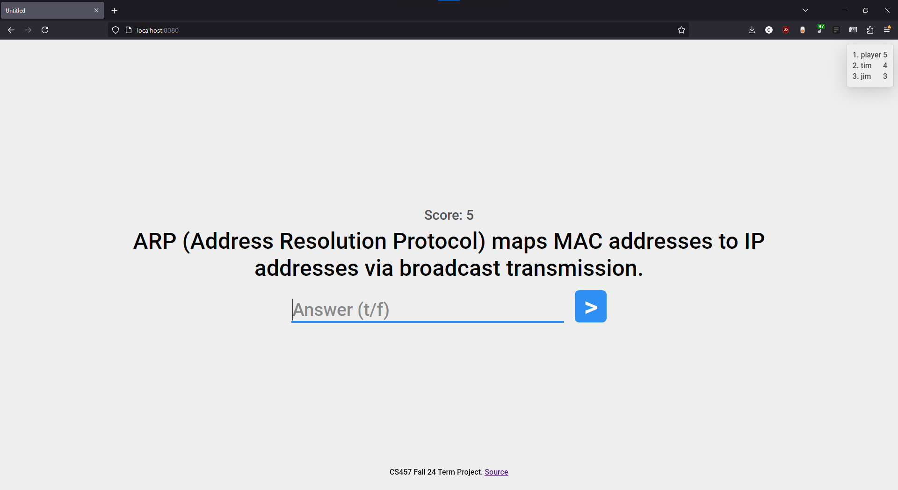
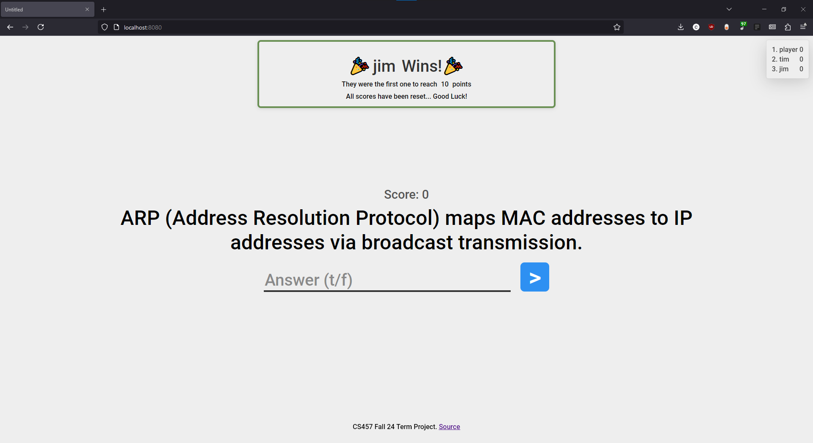

# CS457 Fall 2024 Term Project

A simple real-time multiplayer competitive quiz game coded in python and
JavaScript.

This project is built on a client-server architecture and allows multiple
players to compete with each other by answering quiz questions.

**Technologies used:**
* Python
* Sockets



## **How to play:**

1. **Start The Server:** From the `src/game_code` directory run the `server.py` script

```
python3 server.py -p 57054
```

2. **Start a client:** You can either choose between the web or terminal client. The web client is fully-featured and recommended, but the terminal client should work if you can't get it running for some reason.

    - [Web Client Instructions](#web-client-highly-recommended)
    - [Terminal Client Instructions](#terminal-client)

3. **Play the game:** Enter a username and start answering t/f questions. First to 10 points wins!


## Web Client **`HIGHLY RECOMMENDED`**

The web client relies on a [websockify](https://github.com/novnc/websockify)
server running to forward websocket connections to the tcp server.

This allows the web-client to natively talk to the python tcp server using the
same message protocol the terminal client does, while also taking care of
hosting the client files.

### Install `websockify`

To run the web client you'll first need to install `websockify`. 

NOTE: if installing on CS machines you may need to update pip if you run into an error.

1. *recommended* Install using the `requirements.txt` file, then run using
   `python3 -m websockify`.
- If you're using Debian (or any other OS setup to use an externally managed python environment) and you want to install `websockify` globally you can install it with `sudo apt install python3-websockify`
- If you're using another setup you should be able to run `pip3 install websockify`.
- If that doesn't work look at [their repository](https://github.com/novnc/websockify) for other installation options.

### Running web client

You can start the web client server using the `run_web_client.sh` script in the
root of the repository. This takes the same arguments as the deliverables
mentions, plus a couple extra.

```
./run_web_client.sh -i localhost -p 57054 -w 0.0.0.0 -n 8080
```

The client will automatically connect to the websocket hosted by the web server.

#### Running the web client manually

From the `src/web_client` directory run the command...

```bash
websockify 8080 127.0.0.1:57054 --web=./
```

This sets up a web server and web socket bridge that servers the client's files and forwards client connections.

NOTE: you can run this on another port, but you'll have to modify the line at the top of the `script.js` file to point to the correct server.

Make sure the server is running at the `127.0.0.1:57054` address

## Terminal Client

From the `src/game_code` directory run the `client.py` script on two different machines or terminals.

NOTE: This client was used earlier in development, so the web-client is considered the "proper" way to use the application

```bash
python3 client.py -i localhost -p 57054
```

**Additional resources:**
* https://www.python.org/doc/
* https://realpython.com/python-sockets/

# Security/Risk Evaluation

One of the primary security risks in the application currently is that the
server/client's don't fully verify and validate messages. If a message declares
itself as a specific type the server will happily accept it. We also don't have
any limits on the length of each message, meaning that a malicious client could
theoretically fill up the ram of the server by sending a multi-gigabyte long
message. There are also no anti-cheat measures in place to prevent a bot from
spamming answers or by filling up the game with fake accounts. Although there
are no inherent limits with the number of clients our game can support, the
operating system and machine it's running on do have ram and network resource
limits that could be easily hit by a knowledgeable attacker.

Many of these could be fixed by doing a heavy pass to properly limit and
validate all data, which would allow us to close bad connections, limit message
size, etc.

## Extra Screenshots





## Retrospective - Game Development Pivot

### Project Overview

Our team initially set out to develop a battleship game, but successfully pivoted 
to creating a Q&A game. This retrospective examines the journey, challenges faced,
and key learnings from this experience.

### Timeline and Pivot

The project spanned the length of the semester with:
- Majority of the semester focused on battleship game development
- Strategic pivot to Q&A game once it became clear that the deadlines were at risk
- Successfully met project deadline with revised scope

### Challenges Encountered

#### Initial Phase - Battleship Game

##### Increasing code complexity

- Additional Features led to mounting technical complexity
- Integration challenges with new functionality
- Growing Technical Debt
  
##### Resource Constraints

- Competing priorities from other concurrent classes and projects
- Fixed deadline pressure
- Limited bandwidth for handling expanding scope

#### Adaptation and Solution

Heeding the professor's suggestion, we shifted the project to a Q&A game format.
This proved to be a crucial turning point as this decision:
- Significantly reduced development complexity
- Accelerated our development timeline
- Maintained alignment with assignment requirements
- Allowed for better resource management

#### Key Successes

##### Effective Problem Recognition

- Early identification of scope creep issues
- Proactive response to mounting challenges
  
##### Adaptive project management

- Successful pivot to a more manageable scope
- Maintained team cohesion during transition
- Met original deadline despite inital setbacks
  
#### Lessons Learned

##### Workload Estimation

- Importance of realistic initial scope assessment
- Need for buffer time in project timelines
- Better understanding of team and individual capacity alongside other commitments

##### Expectation Management

- Setting clear boundaries for feature additions
- Importance of maintaining focus on core requirements
- Regular alignment checks with project objective
  
##### Team Dynmaics
- Value of open communication during challenges
- Importance of flexibility in approach
- Strength in collaborative problem-solving

#### Reccomendations for Future Projects
##### Implementation Phase

- Start with minimal viable product (MVP)
- Establish clear scope boundaries early
- Regular complexity assessment checks
  
##### Project Planning

- More detailed initial workload estimation
- Better integration of concurrent project demands
- Clear criteria for scope change decisions

##### Team Processes

- Regular checkpoints for scope evaluation
- Clear communication channels for raising concerns
- Defined process for scope change decisions

#### Conclusion

While the project didn't result in the initially planned battleship game, 
the team demonstrated remarkable adaptability and pragmatism in pivoting to 
a successful Q&A game. The experience provided valuable insights into project 
management, scope control, and team dynamics that will benefit future projects.
The successful delivery of the final product, despite the challenges, showcases
the teams resiliance and problem-solving capabilities.


